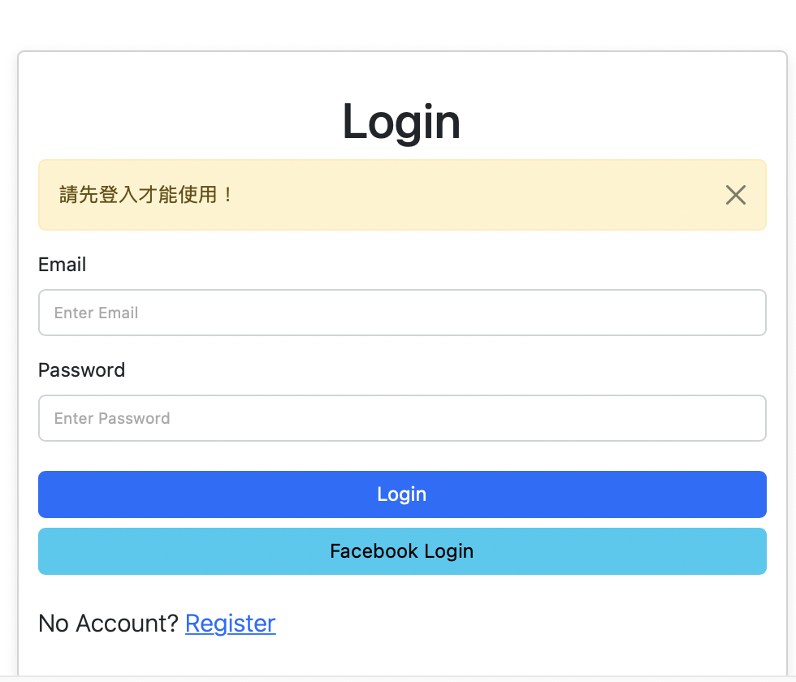

# 我的餐廳清單




## 介紹
紀錄屬於自己的餐廳清單, 可以瀏覽餐廳、查看詳細資訊、甚至連結到地圖

### 功能
- 使用者認證系統
   - 使用者可以註冊帳號登入或使用Facebook Login 
   - 密碼使用bcrypt加密 
- 使用者有獨自的餐廳清單
   - 查看所有餐廳
   - 瀏覽餐廳的詳細資訊
   - 連結連結餐廳的地址到Google地圖
   - 搜尋特定餐廳
   - 增刪改查餐廳


## 開始使用

1. 請先確認有安裝node.js 與npm
2. 將專案clone到本地
3. 將本地開啟之，透過終端機進入資料夾，輸入：

   ```bash
   npm install
   ```
4. 建立 .env檔案 內容輸入連線字串
   MONGODB_URI=
   FACEBOOK_CALLBACK=http://localhost:3000/auth/facebook/callback 
   FACEBOOK_ID=
   FACEBOOK_SECRET=  
   PORT=3000
   SESSION_SECRET=ThisIsMySecrets

5. 安裝完畢後繼續輸入：
   ```bash
   npm run start
   ```
6. 若看見此行訊息則代表順利運行，打開瀏覽器進入到以下網址

   ```bash
   Listening on http://localhost:3000
   ```

7. 若欲暫停使用

   ```bash
   ctrl + c
   ```

8. 除了Facebook登入 ,可使用下列三組帳密登入.
   ```bash
   email: user1@example.com
   password: 12345678
   ```
   ```bash
   email: user2@example.com
   password: 12345678
   ```

    ```bash
   email: root@example.com
   password: root
   ```

## 開發工具

- Node.js 10.15.0
- Express 4.17.1
- Express-Handlebars 5.3.3
- Bootstrap 5.2.1
- Font-awesome 5.8.1